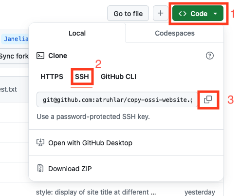
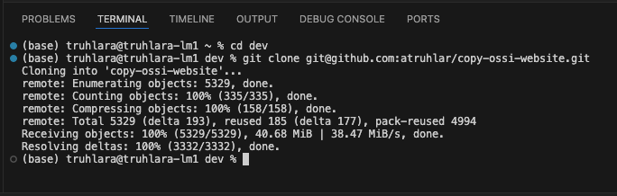
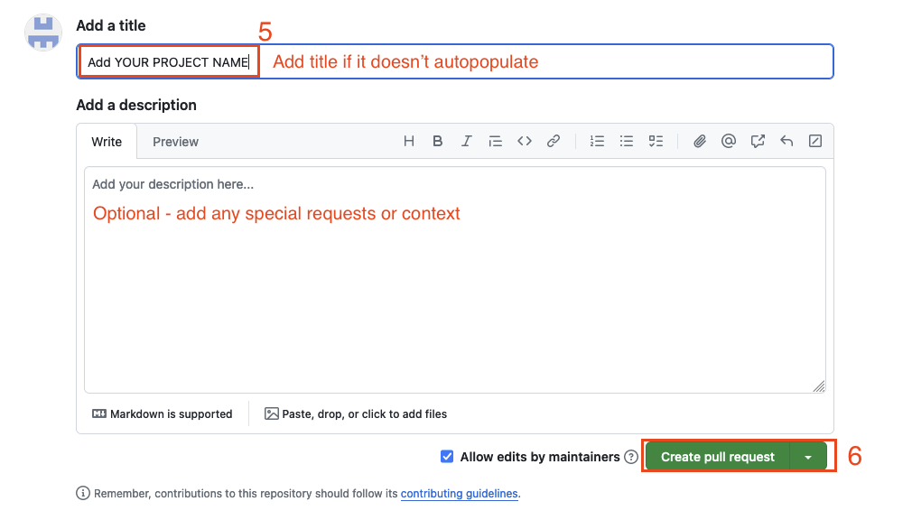

# Contributing Guidelines

## Contents

- [Quick reference](#quick-reference)
- [Prerequesites](#prerequisites)
- [Set-up](#set-up)
- [Add a new project](#add-a-new-project)
- [Edit a project](#edit-a-project)
  - [Edit the frontmatter](#edit-the-frontmatter)
  - [Guidance for tag variables](#guidance-for-tag-variables)
  - [Optional - edit the project description](#optional---edit-the-project-description)
  - [Optional - add an image](#optional---add-an-image)
  - [Requesting new tag categories or options](#requesting-new-tag-categories-or-options)
- [Preview and push your changes to GitHub](#preview-your-project-page-and-push-your-changes-to-github)
- [Open a pull request](#open-a-pull-request)

## Quick reference

The main steps of contributing to this repo. Read on or refer to specific sections, listed above, for additional details.


## Prerequisites

1. A **[GitHub account](https://docs.GitHub.com/en/get-started/quickstart/creating-an-account-on-GitHub)**
2. A **code editor** (e.g., [Visual Studio Code](https://code.visualstudio.com/download)) installed on your local computer
3. **Git** installed on your local computer
   - Need to install Git? [Download it here](https://git-scm.com/book/en/v2/Getting-Started-Installing-Git).
4. **Node.js (v18.14.1 or later) and npm** (comes installed with Node) installed on your local computer
   - Need to install Node? [Download it here](https://nodejs.org/en/download).

<details>
  <summary>Want to check if you have Git, Node, and npm installed, or to confirm that your installation worked?</summary>
  
<br/>Use the below commands in the terminal. If the software is successfully installed, each command will return the corresponding software's version number to the terminal.

```
git -v
node -v
npm -v
```

</details>

## Set-up

<details>
 <summary> 
   
   #### Fork the OSSI website repository to create your own copy of the repository on your GitHub account.
   
 </summary>
  
  1.  On GitHub.com, naviagate to the [JaneliaSciComp/ossi-website](https://github.com/JaneliaSciComp/ossi-website) repository page.
  
  2.  In the upper-right corner of the page, click **Fork**.
    

3.  On the next page, you can keep the defaults and click **Create Fork** in the lower right. Or, optionally, you can change the repository name or description to be different than ossi-website, to further distinguish your copy from the original repository.

</details>
<details>
 <summary> 
   
   #### Clone your forked repository, to make it available on your local computer.
   
 </summary>
  
  1.  On the [JaneliaSciComp/ossi-website](https://github.com/JaneliaSciComp/ossi-website) repository page, above the list of files, click the green **Code** button.

2.  In the dropdown that appears, select the **SSH** tab.

3.  Click the **Copy** icon found to the right of the SSH key.
    

**Note**: If you see an error like the below when attempting to copy the SSH key, please follow the instructions in [this tutorial](https://sbme-tutorials.github.io/2019/data-structures/notes/ public_key.html) to create a public SSH key for your GitHub account.


4.  Open a new terminal in your code editor.

5.  Change the current working directory to the location where you want the cloned directory, e.g.,:

```
cd PATH/TO/DESIRED/LOCATION/HERE
```

6.  Type `git clone` and then paste the SSH key you just copied. E.g.,:

```
git clone git@github.com:YOUR-USERNAME/YOUR-REPO-NAME.git
```

7.  Hit enter to clone the repo onto your local computer. You should see output in the terminal like the below.
    

</details>
<details open>
<summary>
  
  #### Install the repository dependencies and start the local dev server to preview a local copy of the website.
  
</summary>
  
  1.  In the terminal of the code editor, navigate to your local directory with the cloned repo.

```
cd path/to/local/YOUR-REPOSITORY-NAME
```

2.  Type the below two commands in the terminal - the first command directs npm to install dependencies specific to the repo and the second starts the local server and opens it automatically in your default web browswer.

```
npm install
npm run dev
```

**Note:** If the local server does not automatically appear in your web browser, input `localhost:4321/ossi-website` into your preferred web browser to view the website.

</details>

## Add a new project

Below is an abbreviated file tree showing key folders and files you'll find in your local copy of the repository.
**If a Markdown file for your project already exists in `src/content/projects` - skip to [Edit a project](#edit-a-project).**

```text
/
├── public/
│   └── project-images/
└── src/
    └── content/
        └── projects/
            └── _project-template.md
```

1. Copy `/src/content/projects/_project-template.md` and paste a duplicate of the file into the same folder (`/src/content/projects/`). Rename the template file with your software project's title in **lowercase**, with dashes replacing spaces.
   - For example, if your software is called "Awesome Software", you would rename the file as `awesome-software.md`.
   - If your software is called "AwesomeSoftware", the file name would be `awesomesoftware.md`

Open your project file to view its contents. At the top of the file are data sandwiched between triple-dashes (---). These data are collectively called **frontmatter** and are used by Astro to populate the webpage content for a project.

2. **Start by editing the `title` field. The title value must match the name of your project file name with each dash converted to a space**, but it can have whatever casing you desire.
   - For example, if your project file is named `awesome-software.md`, your `title` entry can appear as:
     `title: Awesome Software` or
     `title: AWESOME SOFTWARE` or
     `title: AWEsome Software` etc...
     But the title cannot be `title: AwesomeSoftware` - this is equiavlent to a file name of `awesomesoftware.md`.

## Edit a project

At the top of your project file are data sandwiched between triple-dashes (---). These data are collectively referred to as **frontmatter** and are used by Astro to populate the content on your project's webpage.

### Edit the frontmatter

- Follow the examples and guidance in `/src/projects/_project-template.md` to fill out your project file's frontmatter. Additional details are provided in a table below.

- For each **required** field, you must provide a value or an error will be thrown when you try to view your project page on the local server.

- For each **optional** field, **if you do not wish to provide a value you must comment out or delete the entire entry.**

- A formatting note for all fields - if you use a colon in your provided value, you must wrap the entire phrase in quotes. Similarly, if you need to use quotation marks in the value, use single quotes and then wrap the entire phrase in double quotes. Otherwise, quotes are optional.

<details>
 <summary>

#### Table with detailed guidance for project data fields

 </summary>
  
  | Field name                       | Required or optional                                                                                      | How to complete                                                                                                                                                                                                                                                                                                              |
| :------------------------------- | :-------------------------------------------------------------------------------------------------------- | :--------------------------------------------------------------------------------------------------------------------------------------------------------------------------------------------------------------------------------------------------------------------------------------------------------------------------- |
| `title`                          | Required                                                                                                  | Your project title.                                                                                                                                                                                                                                                                                                          |
| `tagline`                        | Required                                                                                                  | One or two sentences describing your project.                                                                                                                                                                                                                                                                                |
| `maintainer`                     | Required                                                                                                  | The maintainer of the project page on this website. This should be the name of one primary point-of-contact.                                                                                                                                                                                                                 |
| `project type`                   | Required                                                                                                  | Pick **one** of the three options provided in the template based on whether your software project is currently or was ever supported by OSSI: `[OSSI - current, OSSI - previous, Other]`. Delete the other two options, leaving the square brackets around your choice.                                                      |
| `OSSI project status`             | Required for current and previous OSSI-funded projects                                                    | Pick one option: `[Proposed, Accepted, Active Development, Maintenance]`. Leave the square brackets around your choice.                                                                                                                           |
| `OSSI proposal link`             | Required for current and previous OSSI-funded projects                                                    | Preferred: upload the proposal as a PDF to `public/proposals` and provide the link in the format `./../proposals/PROPOSAL.pdf`. Other option: provide the URL to the externally hosted proposal.                                                                                                                             |
| `github link`                    | Required                                                                                                  | Link to the software project's GitHub repository.                                                                                                                                                                                                                                                                            |
| `documentation link`             | Required                                                                                                  | Link to software documentation - can be the same as the GitHub repo if the README is the documentation                                                                                                                                                                                                                       |
| `installation instructions link` | Required                                                                                                  | Link to software installation instructions - can be the same as the GitHub repo                                                                                                                                                                                                                                              |
| `preferred contact method`        | Encouraged if there is a preferred way for users to reach out for help other than creating an issue in the project's GitHub repo.                                                                                                | Examples: link to Image.sc forum, or an email in the format of mailto:email@example.com. Used to create the link for the 'Reach out for help' button on the project page.  |
| `how to cite text`               | Required if your software has an associated published paper or DOI                                        | The citation for your software - wrap in quotes to ensure colons are interpreted correctly. If your software doesn't have an associated published paper or DOI, leave this blank.                                                                                                                                            |
| `how to cite link`               | Optional. </br> _Reminder - comment out or delete optional fields you do not wish to provide a value for_ | A DOI. Wrap in quotes to ensure the colon is interpreted correctly. If a DOI is not available, leave this blank - your GitHub repo will be used as the default. Each DOI should start with `https://doi.org/`                                                                                                                |
| `additional links array`         | Optional                                                                                                  | Optional external links formatted in a comma-separated array. If there is a colon in a link, wrap the entire link in quotations. For example, you could provide links to a project homepage, an externally-hosted blog post, additional publications, etc.                                                                   |
| `additional links text array`    | Optional                                                                                                  | If your project has an associated blog post file, provide the file name here in square brackets, without the .md extenstion (e.g., `[my-related-blog-post-file]`). If there is more than one related blog posts separate the file names by commas.                                                                           |
| `image file`                     | Optional                                                                                                  | Format as: `image-file-name-with-no-spaces.fileExtension`<br/> Then see [Adding an image](#optional---add-an-image) for more information about uploading an image. Note - only one image file is supported at this time.                                                                                                     |
| `image caption`                  | Required if you add an image file                                                                         | A brief description of the image - this will be displayed on the site                                                                                                                                                                                                                                                        |
| `youtube url`                    | Optional                                                                                                  | Link to a YouTube-hosted video demoing your software.                                                                                                                                                                                                                                                                        |
| `youtube caption`                | Required if you add a video link                                                                          | A brief description of the video - this will be displayed on the site                                                                                                                                                                                                                                                        |
| `youtube params`                | Optional                                                                          |  Supports any YouTube params: https://developers.google.com/youtube/player_parameters#Parameters. See Astro Embed documentation for more guidance: https://astro-embed.netlify.app/components/youtube/#params                                                                                                                                                                                                                                                        |
| `development team`               | Optional                                                                                                  | [Tag variable - see guidance](#guidance-for-tag-variables)                                                                                                                                                                                                                                                                   |
| `programming language`           | Optional                                                                                                  | [Tag variable - see guidance](#guidance-for-tag-variables)                                                                                                                                                                                                                                                                   |
| `open source license`            | Optional                                                                                                  | [Tag variable - see guidance](#guidance-for-tag-variables)                                                                                                                                                                                                                                                                   |
| `software type`                  | Optional                                                                                                  | [Tag variable - see guidance](#guidance-for-tag-variables)                                                                                                                                                                                                                                                                   |
| `use case`                       | Optional                                                                                                  | [Tag variable - see guidance](#guidance-for-tag-variables)                                                                                                                                                                                                                                                                   |
| `usage environment`              | Optional                                                                                                  | [Tag variable - see guidance](#guidance-for-tag-variables)                                                                                                                                                                                                                                                                   |
| `software ecosystem`             | Optional                                                                                                  | [Tag variable - see guidance](#guidance-for-tag-variables)                                                                                                                                                                                                                                                                   |
| `supported file types`           | Optional                                                                                                  | [Tag variable - see guidance](#guidance-for-tag-variables)                                                                                                                                                                                                                                                                   |

</details>

### Guidance for "tag" fields

Tags are used to allow website visitors to filter displayed projects.

- **Use only the tag categories and options provided in the project template.** If the spelling or capitalization is incorrect, you will be asked to go back and edit the your project file to ensure consistency across projects.
- Delete any tag options provided in the project template that don't apply to your project. Keep relevant tags inside the square brackets, separated by commas.
- If an entire tag category is not relevant to your project, delete or comment out the entire category and associated options.
  
- We strive to keep the tag categories and example options up-to-date in the project template, but the final reference for the currently-allowed tag categories and options can always be found [here](https://github.com/JaneliaSciComp/ossi-website/blob/main/.github/actions/validTagsList.json).

<details>
  <summary>

#### If you feel there is an additional tag **option** required to describe your project

  </summary>

- Go ahead and add the option(s) to your project file. In your pull request, please note you added the option and provide a brief explanation why. When you open your pull request, these new options will throw a warning for the website maintainer for review.
</details>
<details>
  <summary>

#### If you feel there is an additional tag **category** required to describe your project

  </summary>

- _Do not add the new tag category to your project's template - this will prevent your project page from displaying in your local server._
- Open a separate [pull request](#open-a-pull-request) listing the new tag category(ies) with a brief explanation of why you feel the addition is necessary.

</details>

<details>
  <summary>

### Optional - Edit the project description

  </summary>
You are strongly encouraged to use your software project's GitHub README as it's description. This will minimize the amount of work required by the maintainer to keep the project description and details up-to-date.

To use your project's GitHub README as the project description:

1. Ensure your project is public on GitHub
2. If the template text is still in the Markdown file following the closing triple dashes (---) on the frontmatter - leave it. If you replaced this text with something else, delete everything below the triple dashes.

If you would rather provide a custom project description, you can do so by typing it below the closing triple dashes on the frontmatter. You can use [Markdown syntax](https://www.markdownguide.org/basic-syntax/) to add hyperlinks, layout/text effects (e.g., headings, lists, **bold** or _italic_ text), etc.

</details>

<details>
  <summary>

### Optional - Add an image

  </summary>

1. Add your desired image to `/public/project-images/`, using a filename without spaces.
2. Edit your project file to include a value for `image file` as outlined in the [table above](#edit-the-frontmatter).

</details>

## Preview your project page and push your changes to GitHub

<details open>
  <summary>

#### Preview your project page on the local dev server.

  </summary>

1.  Make sure you've saved all your changes on your local computer.

2.  If you don't already have the local dev server running, follow [Step 3 in **Set Up**](#set-up).

3.  Navigate in your web browser to:

```
localhost:4321/ossi-website/projects/<your-project-name>
```

</details>

<details>
<summary>

#### When you're done editing the project file and adding optional images, commit your changes and push them to GitHub.

</summary>

1.  Commit your project file locally by typing the following in your code editor's terminal.

- Note: If you added an image file, you will also need to `git add public/project-images/YOUR-PROJECT-IMAGE-FILE`

```
git add src/content/projects/YOUR-PROJECT-NAME.md
git commit -m "Add YOUR PROJECT NAME"
```

2.  Push your changes to your online GitHub repository by entering the following in your code editor's terminal. Note - this code snippet assumes you are working on the default "main" branch. If you created a branch in your GitHub repo for this specific change, edit "main" to your branch name below.

```
git push origin main
```

</details>

## Open a pull request

<details>
  <summary>
Open a pull request to the main branch, keeping the defaults in place. Title the PR with your project name and whether you are adding or editing it. Optionally, add a description with any specific details or requests.
  </summary>

Navigate to your copy of the ossi-website repository on GitHub.com. Along the top navigation tabs:

1.  Select **Pull Requests**.

2.  On the page that opens, click the green **New pull request** button in the upper right corner.


A page title **Comparing changes** will open. In the dropdown menus:

3.  Check that your pull request is originating from the correct place (your repo and branch) and going to the correct place (the original Janelia/ossi-website repo) - see the exact settings written out below.

- **Base repository** is set to **JaneliaSciComp/ossi-website**
- **Base** is set to **main**
- **Head** repository is set to **YOUR-USERNAME/YOUR-REPO-NAME**
- **Compare** is set to **main** (unless you opened a specific branch to add/edit your project on)

4.  Then click the green **New pull request** button.


The **Open pull request** page will open.

5. Add a title in the format of "Add YOUR PROJECT NAME" or "Edit YOUR PROJECT NAME", if needed. If you only made one commit, the **Add a title** text box should autopopulate as from your commit message. Optionally, you can add specific requests or explanations to the **Add a description** text box.

6. Click the green **Create pull request** button to submit your pull request. **Note**: leave the option **Allow edits by maintainers** checked. This will allow the website maintainers to help edit your project file before completing the pull request, if needed.

</details>

After you submit your pull request, an automated check will run to ensure your tag categories and options are valid.

<details>
  <summary>If the check fails, a comment will publish to your pull request, indicating where the problem is.</summary>
  


To fix the error, return to your code editor and make the required changes to the file. Then follow the instructions to [commit and push your changes](#preview-your-project-page-and-push-your-changes-to-github). These changes will be added to the open pull request. Once there are no tag validation errors, a success comment will post to your pull request.


</details>

Your PR will be reviewed by the maintainers of the OSSI site. You may receive requests for changes before your PR is approved.

### Thank you for your contribution!
